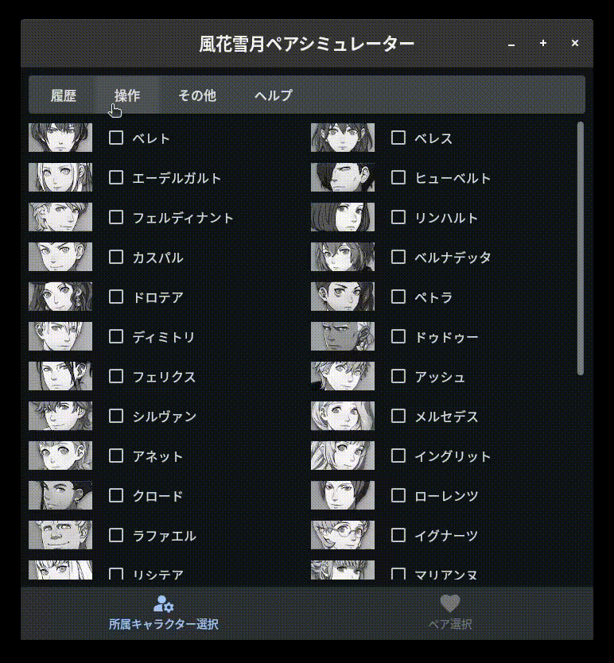

# 風花雪月ペアシミュレーター

支援をB止めして最後に任意のペアを作る時の手助けをするflet製のWebアプリケーションです。

[Webアプリへのリンク](https://feth-pairing-simulator.pages.dev)

## Demo

## Features

- 現在のメンバーに応じた動的なペア選択。
- ペアの履歴の管理。

## Usage

[リンク](./docs/usage.md)

## Note

- 誰と誰のペアにペアエンドが存在する、というネタバレを含みます。

## クレジット

<dl>
 <dt>ファイアーエムブレム 風花雪月の権利表記</dt>
  <dd>© 2019 Nintendo / INTELLIGENT SYSTEMS Co-developed by KOEI TECMO GAMES CO., LTD.</dd>
  <dt>キャラクターデータの参考元</dt>
  <dd><a href="https://www.pegasusknight.com/wiki/fe16/">ファイアーエムブレム 風花雪月 攻略Wiki</a></dd>
 <dt>キャラクターの画像</dt>
  <dd>Nintendo Switchのキャプチャ機能を用いて撮影し、トリミングしたものです。
  </dd>
  <dd>※Nintendo Switchは任天堂の商標です。</dd>
</dl>
